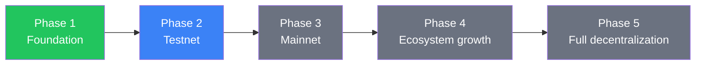

The Fizen Foundation follows a phased roadmap designed to build the protocol deliberately: starting with a solid technical and community foundation, progressing through testnet and mainnet, and ultimately transitioning full control to the community. Each phase has defined deliverables and success criteria before the next begins.

<Note>
  Status indicators reflect the foundation's current progress. The roadmap is a living plan — specific timelines are updated through governance as the protocol evolves.
</Note>

## Phases at a glance

---

## Phase 1: Foundation <Badge color="green">Completed</Badge>

The foundation phase establishes the intellectual and organizational bedrock of the Fizen protocol. No code ships before the design is sound, and no community forms without a shared understanding of the mission.

**Deliverables**

- Protocol design: consensus model, architecture, and security model finalized
- Whitepaper published and open for public review
- Core team assembled across engineering, research, and operations
- Initial community established across forums and social channels
- Legal structure of the Fizen Foundation incorporated
- Open-source repositories published under a permissive license

**Success criteria:** Whitepaper ratified by the founding team; community channels active with at least initial contributor participation.

---

## Phase 2: Testnet <Badge color="blue">In progress</Badge>

Testnet is where the protocol meets the real world. Developers onboard, users test assumptions, and adversarial researchers search for weaknesses — all in a low-stakes environment designed to surface issues before they matter.

**Deliverables**

- Public testnet deployment with faucet access for test tokens
- Developer documentation, SDK releases, and example applications
- Structured developer onboarding program (tutorials, office hours, sandbox environments)
- Community testing campaigns with guided scenarios and feedback channels
- Bug bounty program launched with defined scope and reward tiers
- Testnet validator program open to applicants

**Success criteria:** At least one full cycle of community testing completed; all critical and high-severity bug bounty findings resolved.

<Tip>
  If you are a developer and want to participate in testnet, see the [Community](/ecosystem/community) page to find the developer grants program and the bug bounty scope.
</Tip>

---

## Phase 3: Mainnet launch <Badge color="gray">Upcoming</Badge>

Mainnet launch is the most consequential milestone in the roadmap. The FIZEN token becomes live, validators secure the network for real, and governance transitions from advisory to on-chain.

**Deliverables**

- Token Generation Event (TGE): FIZEN token minted according to the [distribution schedule](/tokenomics/distribution)
- Initial validator set activated and staking enabled
- On-chain governance activated: proposal submission, voting, and execution all live
- Foundation multi-sig replaced by governance-controlled treasury
- Exchange listings for liquidity (coordinated with exchange partners)
- Security audit results published in full

**Success criteria:** Network produces finalized blocks without incident for a defined stabilization period; governance successfully executes its first on-chain proposal.

<Warning>
  The TGE date is subject to the successful completion of all security audits and testnet success criteria. The foundation will not rush mainnet launch to meet an arbitrary deadline.
</Warning>

---

## Phase 4: Ecosystem growth <Badge color="gray">Upcoming</Badge>

With mainnet stable, the foundation shifts focus from building the core protocol to growing the ecosystem around it — funding developers, integrating with the broader blockchain landscape, and upgrading the protocol through governance.

**Deliverables**

- Ecosystem grants program fully operational (see [Community](/ecosystem/community) for grant details)
- Infrastructure and application partner integrations live (see [Partners](/ecosystem/partners))
- Protocol upgrade process ratified: improvement proposals, specification changes, and coordinated network upgrades governed on-chain
- Cross-chain bridge integrations for major asset corridors
- Developer tooling and indexing infrastructure funded and maintained by the ecosystem
- Foundation publishes annual transparency report: treasury balances, grant allocations, and protocol metrics

**Success criteria:** At least one community-initiated protocol upgrade successfully deployed on mainnet; grants program has funded at least one cohort of projects.

---

## Phase 5: Full decentralization <Badge color="gray">Upcoming</Badge>

Full decentralization is the terminal goal of the Fizen Foundation. The foundation's role is not to govern forever — it is to build the conditions under which the community can govern itself.

**Deliverables**

- Foundation reduces its governance voting weight to a minority position
- Core protocol development responsibilities transferred to community-elected bodies
- Foundation treasury transferred in full to on-chain governance control
- Foundation transitions to an advisory and advocacy role only
- Fizen Improvement Proposal (FIP) process owned entirely by the community
- Independent security council established by governance vote

**Success criteria:** The protocol operates through at least two full governance cycles — including treasury disbursements and a protocol upgrade — without foundation intervention.

<Info>
  Full decentralization does not mean the foundation disappears. The foundation will continue to advocate for the Fizen ecosystem, support public goods, and participate as one voice among many in governance.
</Info>
